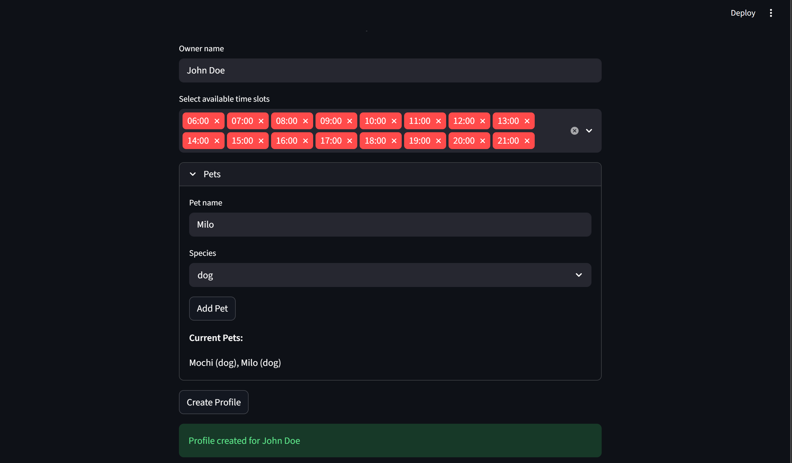
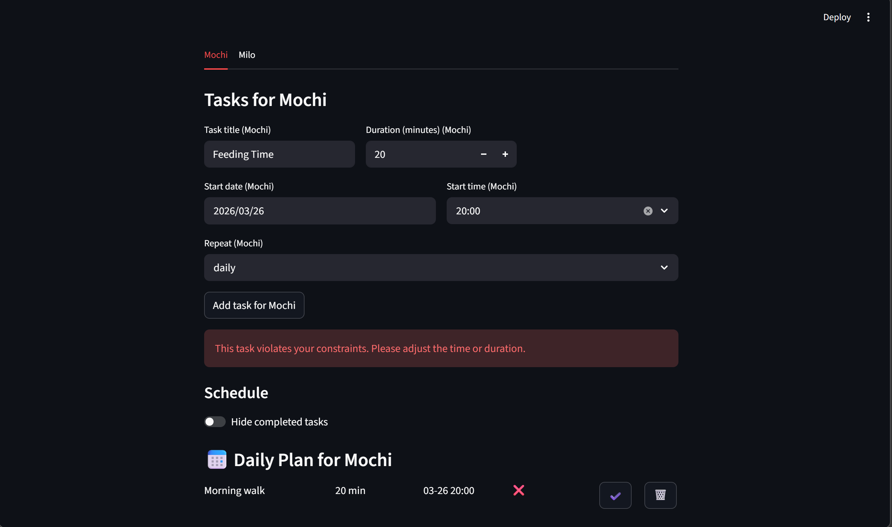
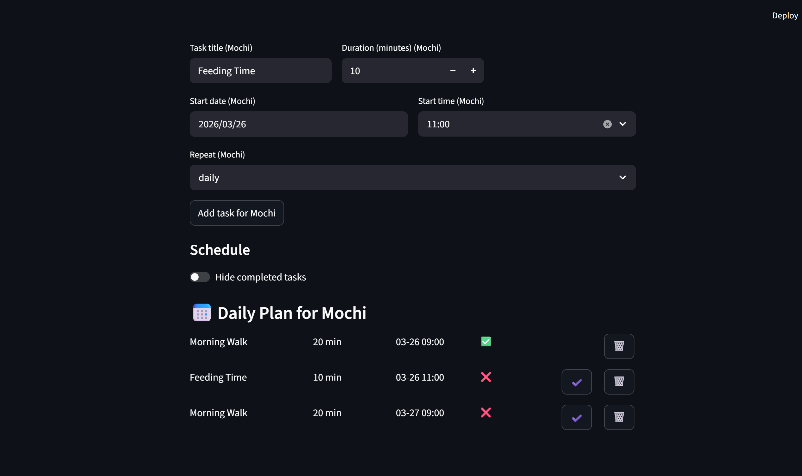
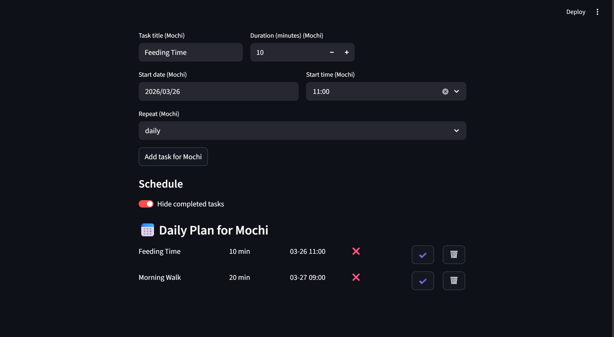

# PawPal+ (Module 2 Project)

You are building **PawPal+**, a Streamlit app that helps a pet owner plan care tasks for their pet.

## Scenario

A busy pet owner needs help staying consistent with pet care. They want an assistant that can:

- Track pet care tasks (walks, feeding, meds, enrichment, grooming, etc.)
- Consider constraints (time available, priority, owner preferences)
- Produce a daily plan and explain why it chose that plan

Your job is to design the system first (UML), then implement the logic in Python, then connect it to the Streamlit UI.

## What you will build

Your final app should:

- Let a user enter basic owner + pet info
- Let a user add/edit tasks (duration + priority at minimum)
- Generate a daily schedule/plan based on constraints and priorities
- Display the plan clearly (and ideally explain the reasoning)
- Include tests for the most important scheduling behaviors

## Getting started

### Setup

```bash
python -m venv .venv
source .venv/bin/activate  # Windows: .venv\Scripts\activate
pip install -r requirements.txt
```

### Suggested workflow

1. Read the scenario carefully and identify requirements and edge cases.
2. Draft a UML diagram (classes, attributes, methods, relationships).
3. Convert UML into Python class stubs (no logic yet).
4. Implement scheduling logic in small increments.
5. Add tests to verify key behaviors.
6. Connect your logic to the Streamlit UI in `app.py`.
7. Refine UML so it matches what you actually built.


## Main Features

**Time-based scheduling:** tasks are validated against the user's available time slots and total free time budget before being added to the plan, ensuring nothing gets scheduled outside the owner's availability.

**Add-pets section:** users can add as many pets as they want as long as the include the name and species of the pet.

**User-info section:** users can add their info like their name and available times that the scheduler can take advantage of to create a good schedule for them.

**Per-pet scheduling:** each pet gets its own independent plan and task list, managed through a tabbed interface so owners with multiple pets can track each animal's care separately.

**Constraint validation:** every task is checked for start time eligibility, time overlap with existing tasks, and total duration budget before being accepted, with clear error feedback if any check fails.


### Smarter Scheduling

The scheduler includes four core features that work together to automate and organize daily pet care.

**Sorting:** tasks are automatically sorted in chronological order before being added to the plan, so the schedule always flows from earliest to latest without any manual reordering from the user.

**Filtering:** users can toggle a "hide completed tasks" switch to not show completed tasks in the schedule view, showing only the tasks that still need to be done for the day.

**Automated Recurring Tasks:** when a task marked as daily or weekly is completed, the scheduler automatically generates the next occurrence using Python's timedelta, scheduling it one day or one week out respectively. This removes the need to manually re-enter routine care tasks like feeding or medication.

**Conflict Detection:** the scheduler scans all scheduled tasks pairwise and flags any two tasks whose time windows overlap, surfacing a warning message rather than silently dropping or crashing. This keeps the user informed without disrupting the rest of the schedule. This is done mainly in App.py that takes advantage of the Constraints class in the system code.

## Testing PawPal+

### 5 Main Methods Tested (description)

Covers:
  1. Chronological sorting  — tasks added out of order come out sorted correctly.
  2. Constraint validation  — rejects overlapping, over-budget, and invalid-slot tasks.
  3. Recurring tasks        — mark_complete() produces the right next-occurrence datetime.
  4. Conflict detection     — flags overlapping pairs; ignores back-to-back tasks.
  5. Completion filtering   — excludes done tasks; handles all-complete and empty plans.


Confidence Level: ⭐⭐⭐⭐⭐

## Demo

### Create Profile


### Add Tasks



### Conflicting Tasks



### Recurring Tasks



### Filtering


