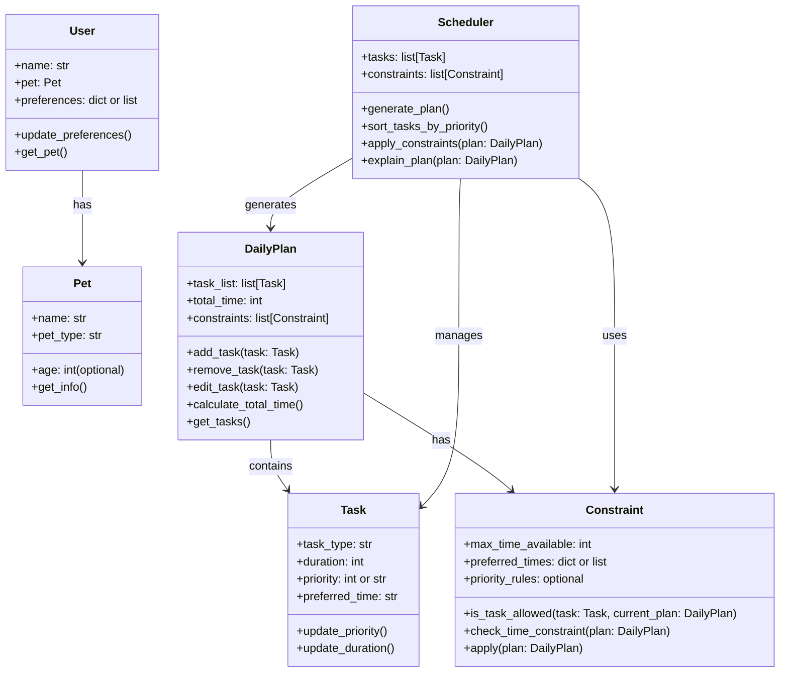

```mermaid
classDiagram
    class User {
        +name: str
        +pet: Pet
        +preferences: dict or list
        +update_preferences()
        +get_pet()
    }

    class Pet {
        +name: str
        +pet_type: str
        +age: int (optional)
        +get_info()
    }

    class Task {
        +task_type: str
        +duration: int
        +priority: int or str
        +preferred_time: str
        +update_priority()
        +update_duration()
    }

    class DailyPlan {
        +task_list: list[Task]
        +total_time: int
        +constraints: list[Constraint]
        +add_task(task: Task)
        +remove_task(task: Task)
        +edit_task(task: Task)
        +calculate_total_time()
        +get_tasks()
    }

    class Scheduler {
        +tasks: list[Task]
        +constraints: list[Constraint]
        +generate_plan()
        +sort_tasks_by_priority()
        +apply_constraints(plan: DailyPlan)
        +explain_plan(plan: DailyPlan)
    }

    class Constraint {
        +max_time_available: int
        +preferred_times: dict or list
        +priority_rules: optional
        +is_task_allowed(task: Task, current_plan: DailyPlan)
        +check_time_constraint(plan: DailyPlan)
        +apply(plan: DailyPlan)
    }

    User --> Pet : has
    DailyPlan --> Task : contains
    DailyPlan --> Constraint : has
    Scheduler --> Task : manages
    Scheduler --> Constraint : uses
    Scheduler --> DailyPlan : generates
```